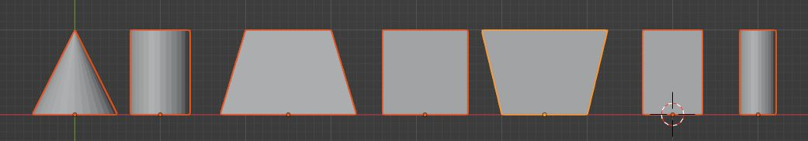
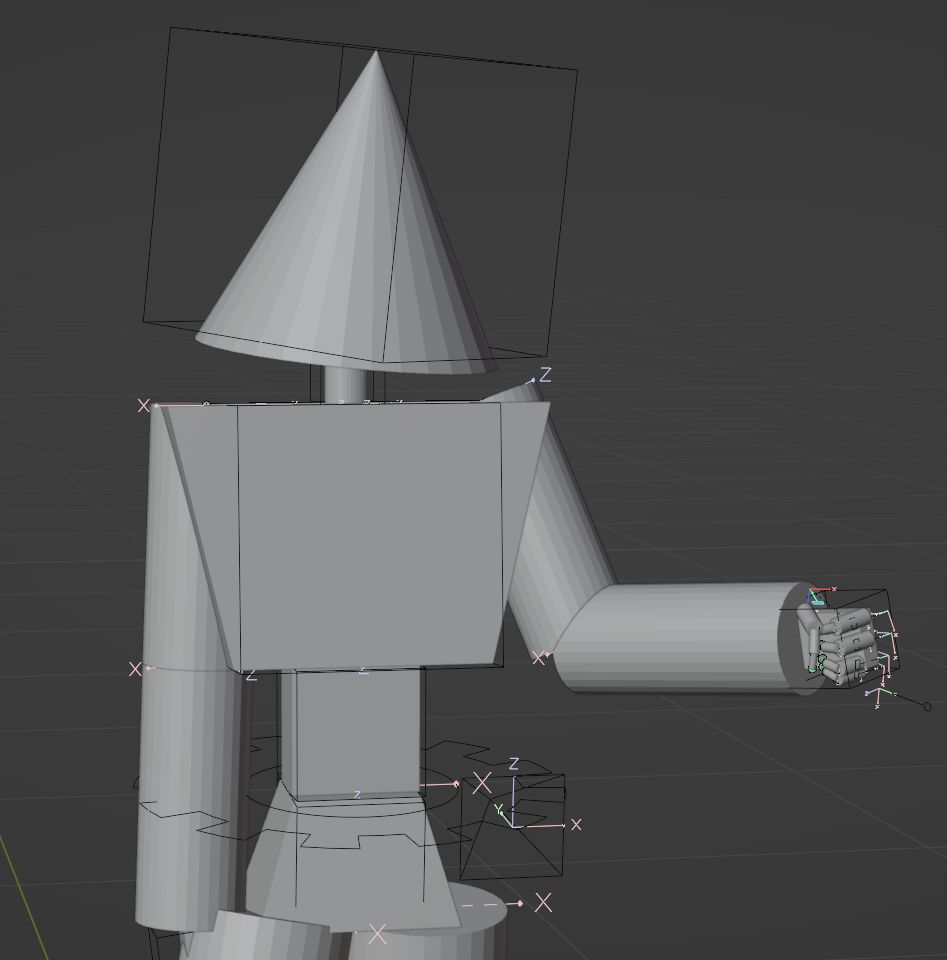

# 部品化したモデリング

今回のモデリングは、すべて weight blend せずにすべて 1weight にする方針にした。
球体関節とかそういう路線。
Armature の bone を Object の parent に指定することにする。
部品ごとに object を分割してモデリングしてみる。
blender のボーンに tail があることを利用して、 head-tail 長が部品のサイズであることにして、
組み立てるときに mesh を bone の長さで scale する。
各部品は、 headが(0,0,0)でtail(0,1,0)である空間でモデリングする。
以下のコードで armature の bone に parent 済みの object に対して、 スケールと位置を調整できた。

```python
import bpy

def fit_parent_bone():
    
    obj = bpy.context.object
    
    parent = obj.parent
    if parent and obj.parent_type == 'BONE':
        bone = parent.data.bones[obj.parent_bone]
        print(bone)
        length = (bone.tail - bone.head).length
        obj.scale = (length, length, length)
        # bone parent is tail position. cancel tail
        obj.location = (0, -length, 0)

fit_parent_bone()
```

- hips, spine, chest, neck, head
- upper, lower, hand, finger
- upper, lower, foot, toe

13パーツ。
さらに手抜きして、棒状のパーツを全部シリンダーにして・・・

- hips, spine, chest, head、 hand
- (cylinder) neck, upperArm, lowerArm, finger, upperLeg, lowerLeg, foot, toe

6パーツ w。
シリンダーが１種類だとあんまりだったので、太い・細いで２種類作って7つ。


すべて Y-UP で高さ１の部品たち。

作ってみてさっそくだが、 
hips から legs への接続と 
chest から arm への接続、 
hand から finger への接続という bone の tail 位置と無関係に joint がある場合は事態が複雑化する。



とりあえず先に進めよう。
左右の部品は負のスケールでいけるのだろうか。
作ってみないとわからんな・・・
