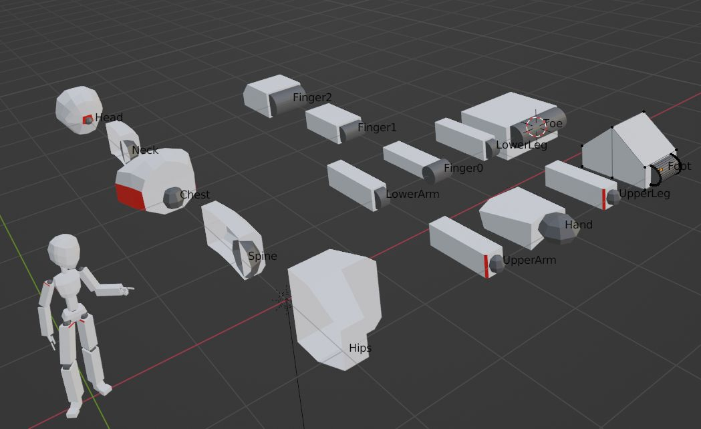
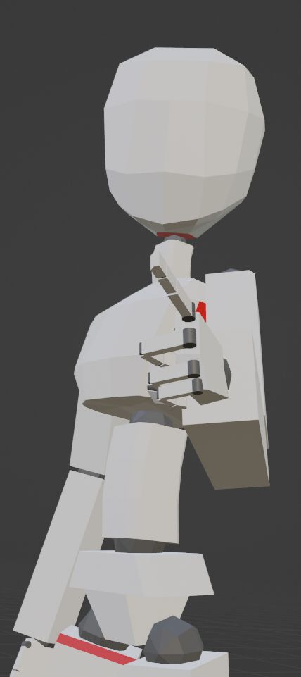

# システム調整

- グリースペンシルであたりをとって、肩の高さを修正(下げた)。
- 腕を専用パーツにして左側を作成。右側を負のスケールにすることで使えることを確認。

```python
        # 右側は `.R` という命名にしている
        if obj.name.endswith('.R'):
            obj.scale = (-length, length, length)
        else:
            obj.scale = (length, length, length)
```

15パーツになった。

- 5: hips-spine-chest-neck-head
- 2: upper-lowerArm
- 4: hand-finger0-1-2
- 4: upper-lowerLeg-foot-toe



head が (0,0,0) で tail が (0,1,0) という規約のおかげで気持ちよくスケールができる。

`foot` の靴底が斜めになってしまって、これじゃない感がある。
lowerLeg からまっすぐに地面にかかとを下ろして `heel` とした方が作りやすいかもしれない。
その場合つま先に位置を知る方法が必要。



今の仕組みだと、手のひらから指ジョイントの位置がわからないので、形を調整できないことがわかった。
頂点グループに指の名前つける方法でやってみるか。
