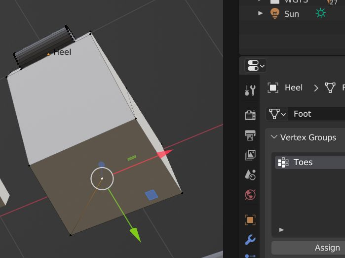
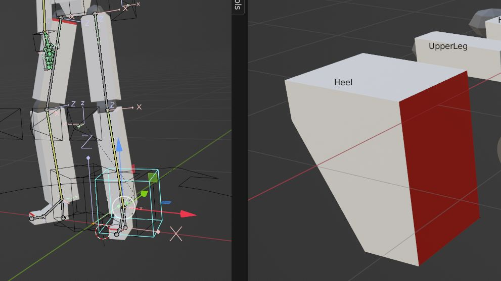
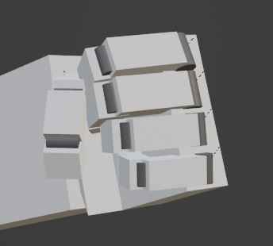

# VertexGroup による ChildBone の位置指定

Bone の head 位置を指示する VertexGroup を作った。



EditBone.matrix と object.scale と 頂点座標を乗算することで ChildBone 位置を算出できた。

```python
new_pos = edit_bone.matrix @ mathutils.Matrix.LocRotScale(None, None, obj.scale) @ vertex_position
```



`Foot` の子ボーン `Heel` を追加して、そちらに対して mesh を配置した。
足mesh が地面に対してまっすぐになった。
副作用で足が地面にめり込んでいたのがなおった。


`Hand` から `ThumbMetacarpal`, `IndexProximal`, `MiddleProximal`, `RingProximal`, `LittleProximal` の場所を指定した。
場所がかっちりしたので指を太くした。
ちょっと良くなった。

ここまではプレースホルダーを作る準備作業。
次回からモデリングが主になる。
たぶん。
