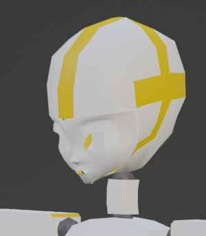

# モデリング開始

入れ物ができたの作り始めたが・・・
うーむ。

いつもと同じ感じになってしまうな。
変な癖がついている。
既存のモデルを研究しよう。

## Assemble: Script を AddOn 化

AddOn 化して定形作業をボタン一発で動くように構築。

- 部品から Link 済みの Object を名前ベースで検索して Humanoid に割当
- Link を Armature の目的のボーンに親子化
- ボーンの長さでスケール

これを Assemble 機能とする。

逆に既存の Skinning Model を部品に分解する、 Disassemble 機能が作れそうなのでやってみよう。
分解してからモデルを観察することで発見がありそうな気がする。

## Disassemble: 分解

Skinning 済みモデルを分解するには、

- 各ボーンについて weight のある頂点を抽出して、 新しい Mesh を作成
- Mesh を bone の向きに回転する
- bone の head-tail が 1 になるようにスケールする

という手順でできそうだ。

Disassemble の引数は、
- target: Mesh
- head: Vector3(bone で指定する)
- tail: Vector3(bone で指定する)
- up: Vector3(TPose: humanoid 前提なので つま先以外は head, tail, global Y+ から計算できる)

Disassemble の引数指定を方法を考えていたのだが、

- target: Mesh `bpy.context.active_object`
- head: Bone `bpy.context.active_bone`
- tail: Bone
  - `bpy.context.selected_bones` から bpy.context.active_bone を除いた最初のボーン
  - なければ bpy.context.active_bone children の最初のボーン
  - なければ bpy.context.active_bone の tail ということにしてみよう

ロジック

- head bone の vertex group に所属する 頂点を選択状態にする
- `bpy.ops.mesh.separate`
- 分離されたオブジェクトを (0, 0, 0) - (0, 1, 0) にスケールする

ある程度動くようになったが、
問題があることもわかった。
例えば頭に関しては頭頂を表すところに tail がある
とは限らないので手動で調整する必要があり自動にできない。
指先、踵に関しても同じ問題がある。

これは置いておいて先に進もう。
